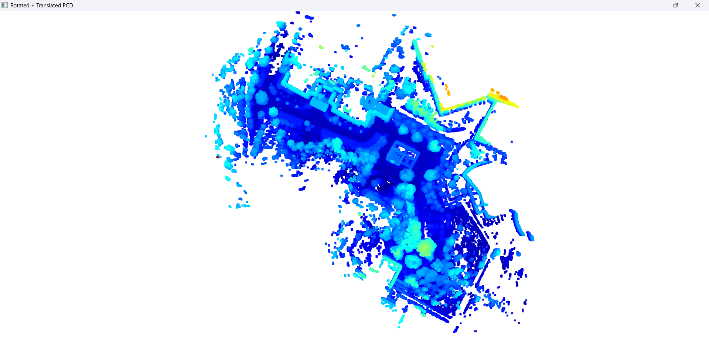

# PCD to Geo-Referenced PCD Converter

This program converts a local LiDAR point cloud (.pcd file) into a geo-referenced point cloud using:

- A known GPS starting and stopping position (latitude, longitude, altitude)
- A drifted angle (rotation in degrees)

It does not require GNSS/IMU integration — only a .pcd file and basic GPS information. The program applies rotation and translation to align the point cloud with real-world geographic coordinates.

---

## 🧭 How It Works

1. Rotation: Rotates the point cloud around the Z-axis based on the heading angle.
2. Translation: Translates the rotated point cloud to the given GPS start location.

---

## 📁 Project Structure

```
├── main.py                 # Main Python script for PCD transformation
├── README.md               # This documentation file
├── requirements.txt        # Python dependencies
├── pointcloud_map.pcd      # Input point cloud file (user-provided)
└── output_transformed.pcd  # Output geo-referenced point cloud
```

---

## 📂 Dataset

The input point cloud file (`pointcloud_map.pcd`) is available on Google Drive.

👉 [Click here to download the dataset](https://drive.google.com/drive/folders/1tbdMGSBHHX3wy8MN74vPKHXFNwjxcOey?usp=sharing)

After downloading, place the pcd file it in the root folder of this project:

```
your-project/
├── main.py
├── pointcloud_map.pcd <-- Place it here
└── ...
```

The program expects this file to exist in the current working directory.

---

## 📂 Input

- pointcloud_map.pcd : Local (non-referenced) point cloud file
- tx (or) x1 (or) x3 -> Latitude - Initial Pose (GPS)
- ty (or) y1 (or) y3 -> Longitude - Initial Pose (GPS)
- tz -> altitude - Initial Pose (GPS) (here, used as 0)
- rz (or) `0` - Degrees (Drifted angle)

---

## 📄 Output

- output_transformed.pcd : Geo-referenced PCD file after transformation

---

## 🔧 Requirements

Python 3.8 or higher.

Install required libraries with:

```
pip install -r requirements.txt
```

Dependencies:
- open3d
- numpy

---

## ▶️ Run the Program

### Step 1: Install Dependencies

```
pip install -r requirements.txt
```

---

### Step 2: Prepare Your Input File

- Make sure your point cloud file is named:
  pointcloud_map.pcd
- Place it in the same directory as main.py.

a. **Convert Latitude & Longitude**

- If your GPS coordinates are in **degree, minutes, seconds (DMS)** format, convert them to **decimal degrees** using this formula:

  ```
  Decimal Degrees = Degrees + (Minutes / 60) + (Seconds / 3600)
  ```

  Example:  
  `17°32'33.8530"N` → `17 + 32/60 + 33.8530/3600 = 17.54273694`N

- If needed, use the  `dms_to_decimal.py` program to convert DMS to decimal degrees automatically.

b. **Translate the local Co-Ordinate to GPS (Initial Pose)**

- Use `main.py` along with the known initial GPS values (latitude and longitude) to translate the local initial point (0, 0) into geographic coordinates (x1, y1). This defines the GPS position corresponding to the origin of your local coordinate system.
- Use the Tier IV Vector Map Builder to manually determine the drift error by identifying the offset at the endpoint (x4, y4).
  
c. **Calculate the Heading Angle (Rotation)**

- Find the angle between the initial point and final point of the path using their lat/lon (or x/y) positions.
- This angle is used to rotate the local map to match geographic orientation.
- The heading is in `θ` degrees and will be used as the `rz` value in the program.


- Use the program  `calculate_angle.py` to compute the angle θ (i.e., rz) based on the given coordinates.
- Use the Tier-IV Vector Map Builder (open source) or any pcd interactive viewer to find the x3,y3.

  [Tier-IV Vector Map Builder](https://tools.tier4.jp/vector_map_builder_ll2/)

Update the following values in `main.py`:

```python
tx = <decimal_latitude>
ty = <decimal_longitude>
tz = <altitude>
rz = <drifted_angle_in_degrees>
```
---

### Step 3: Run the Script

```
python main.py
```

---

### Step 4: View and Save Output

Here is an example visualization of the transformed point cloud:



- A 3D viewer will appear to show the transformed point cloud.
- To close the viewer and terminate the program, press **q** in the viewer window.
- A new file will be saved as:

  output_transformed.pcd

- Terminal output:

  Transformed point cloud saved as 'output_transformed.pcd'.

---

## 💡 Use Cases

- Outdoor LiDAR mapping
- GIS-ready transformation of point clouds
- Field robotics and AV research
- Preprocessing for SLAM or localization pipelines

---

## ✍️ Author

Prakash Kannaiah  
LinkedIn: https://www.linkedin.com/in/prakash-kannaiah

